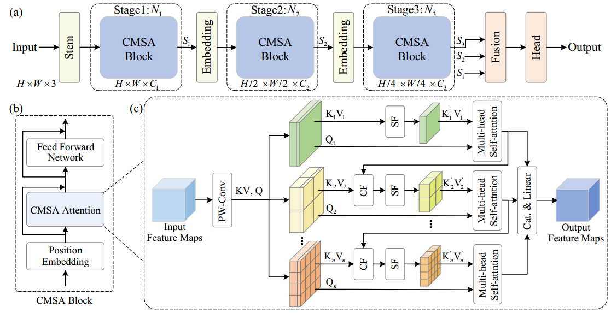

# CMSA
[Cascaded Multi-Scale Attention for Enhanced Multi-Scale Feature Extraction and Interaction with Low-Resolution Images](https://arxiv.org/abs/2412.02197)

The code will be released after the manuscript is published.

# Introduction

- Low-resolution images pose challenges for accurate feature extraction in vision tasks.
- CMSA addresses this by enhancing multi-scale feature extraction and interactions effectively. 
- CMSA employs a novel cascaded attention mechanism to facilitate multi-scale feature integration, replacing the downsampling operations that often result in substantial information loss in low-resolution contexts.
- Experimental results demonstrate that this method boosts performance in practical applications such as human pose estimation, head pose estimation, and more with low-resolution images.

## Architecture

    

<!-- 

    

 -->
