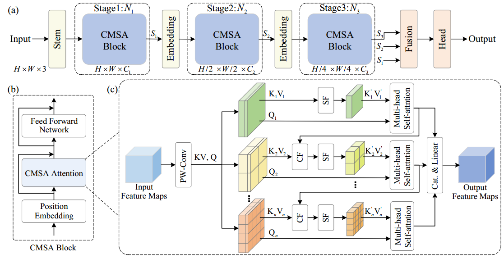

# CMSA: Cascaded Multi-Scale Attention

**[Cascaded Multi-Scale Attention for Enhanced Multi-Scale Feature Extraction and Interaction with Low-Resolution Images](https://arxiv.org/abs/2412.02197)**

Xiangyong Lu, Masanori Suganuma, Takayuki Okatani

> Accepted (with minor revision) by **IEEE Transactions on Multimedia (IEEE TMM), 2026**. Code is being released.

---

## Introduction

In real-world settings—surveillance cameras, distant subjects, or low-performance edge devices—objects are often captured at **low resolution**. This makes it hard to extract and combine the **multi-scale features** that tasks such as human pose estimation rely on. The conventional recipe of building multi-scale features by **downsampling** feature maps quickly destroys detail when the input is already small.

**CMSA (Cascaded Multi-Scale Attention)** is a new attention mechanism for CNN–ViT hybrid architectures that extracts and integrates features across scales **without downsampling the input or feature maps**. It combines:

- **Grouped multi-head self-attention** — attention heads are split into groups, each processing a different scale.
- **Window-based local attention** (à la Swin) — each group uses a different window size `sₖ × tₖ` to form a distinct receptive field, from global (window = full map) to local.
- **Cascaded multi-scale fusion** — features flow from lower to higher scales; each group's output updates the key/value of the next group via **channel fusion (CF)** and **spatial fusion (SF)**.

The result is effective multi-scale feature extraction and cross-scale interaction at **full spatial resolution**, which is especially valuable for low-resolution inputs.

## Architecture

<p align="center">
   <br>
  <em>(a) Overall hierarchical architecture. (b) CMSA block. (c) Cascaded Multi-Scale Attention.</em>
</p>

<p align="center">
   <br>
  <em>Receptive fields and fusion across attention mechanisms. Unlike ViT (single-scale global),
  SwinT (uniform local windows), and Shunted/SG-Former (token-merging that reduces resolution),
  CMSA partitions heads into groups with distinct window sizes and fuses them cascade-style at full resolution.</em>
</p>

### Model Variants

Three variants trade off accuracy against size (see paper, Table I):

| Variant   | Params | Notes                          |
|-----------|:------:|--------------------------------|
| CMSA-S    | ~4.0–4.2 M | Smallest, fastest             |
| CMSA-B    | ~5.4–5.7 M | Balanced                      |
| CMSA-L    | ~7.1–7.4 M | Best accuracy, still lightweight |

All variants use a 3-stage pyramid; stage 1 uses up to `n = 3` head groups with window sizes `{32×24, 16×12, 8×6}`, and later stages use `n = 2` groups with progressively smaller windows.

---

## Human Pose Estimation

Bottom-up human pose estimation on **COCO 2017**, following the HRNet experimental framework. Models predict 17 keypoints from cropped, resized person images; we vary the resize target to control input resolution. Accuracy is measured by Average Precision (AP) based on object keypoint similarity (OKS).

CMSA outperforms state-of-the-art methods **across all resolutions with far fewer parameters**, and the margin widens as resolution drops.

**Results on COCO 2017 val** (selected; FLOPs at single scale):

| Input     | Model      | Params (M) | FLOPs (G) | AP↑     |
|-----------|------------|:----------:|:---------:|:-------:|
| 128 × 96  | HRNet-W32  | 28.5       | 1.9       | 66.9    |
| 128 × 96  | ViTPose-B  | 86.0       | 17.0      | 67.8    |
| 128 × 96  | **CMSA-B** | **5.6**    | 4.1       | 70.3    |
| 128 × 96  | **CMSA-L** | **7.3**    | 5.1       | **71.8** |
| 64 × 48   | UDP (HRNet-W32) | 28.6  | 1.9       | 62.8    |
| 64 × 48   | ViTPose-B  | 86.0       | 16.9      | 63.8    |
| 64 × 48   | **CMSA-B** | **5.6**    | 3.7       | 65.2    |
| 64 × 48   | **CMSA-L** | **7.3**    | 4.6       | **66.0** |
| 32 × 24   | UDP (HRNet-W32) | 28.6  | 1.9       | 51.9    |
| 32 × 24   | ViTPose-B  | 86.0       | 16.9      | 51.2    |
| 32 × 24   | **CMSA-S** | **4.1**    | 0.7       | 52.3    |
| 32 × 24   | **CMSA-B** | **5.6**    | 0.9       | 53.5    |
| 32 × 24   | **CMSA-L** | **7.3**    | 1.1       | **56.4** |

<p align="center">
   <br>
  <em>AP vs. parameters on COCO 2017 (32 × 24 input). CMSA dominates the accuracy–parameter trade-off.</em>
</p>

See [`Human Pose Estimation/`](Human%20Pose%20Estimation/) for code and instructions.

---

## Head Pose Estimation

Landmark-free head pose estimation: predict **yaw, pitch, roll** directly from a cropped face image. Models are trained on **300W-LP** and evaluated on **BIWI** and **AFLW2000**, using binned classification with soft stage-wise regression. Accuracy is reported as **Mean Absolute Error (MAE, lower is better)**.

At low resolutions (64 × 64 and 32 × 32), CMSA reaches **state-of-the-art MAE on AFLW2000 and BIWI**—CMSA-L even beats many models that operate on much higher-resolution inputs.

**Results — MAE↓** (selected):

| Input   | Model        | Params (M) | BIWI MAE↓ | AFLW2000 MAE↓ |
|---------|--------------|:----------:|:---------:|:-------------:|
| 64 × 64 | TokenHPE-v2  | 85.9       | 4.83      | 5.17          |
| 64 × 64 | 6DRepNet     | 43.8       | 4.02      | 5.04          |
| 64 × 64 | **CMSA-B**   | **5.4**    | 4.30      | 4.48          |
| 64 × 64 | **CMSA-L**   | **7.1**    | **3.99**  | **4.38**      |
| 32 × 32 | TokenHPE-v2  | 85.7       | 5.66      | 6.05          |
| 32 × 32 | 6DRepNet     | 43.8       | 5.51      | 6.07          |
| 32 × 32 | **CMSA-S**   | **4.0**    | 4.33      | 4.59          |
| 32 × 32 | **CMSA-B**   | **5.4**    | 4.55      | 4.51          |
| 32 × 32 | **CMSA-L**   | **7.1**    | 4.48      | **4.46**      |

See [`Head Pose Estimation/`](Head%20Pose%20Estimation/) for code and instructions.

---

## Datasets

| Task                  | Train      | Evaluation            |
|-----------------------|------------|-----------------------|
| Human pose estimation | COCO 2017  | COCO 2017 val         |
| Head pose estimation  | 300W-LP    | BIWI, AFLW2000        |

Low-resolution inputs are produced by resizing crops to the target size (e.g. 32 × 24 for pose, 32 × 32 for head pose)—**no super-resolution preprocessing is used**. In the paper, applying SR (SwinIR) before pose estimation actually *hurts* accuracy, since it improves visual reconstruction but not the spatial cues needed for keypoint localization.

## Key Takeaways

- **Fewer parameters, higher accuracy** — CMSA-L uses ~7 M parameters vs. 28–87 M for typical baselines, yet leads at every resolution tested.
- **Robust to low resolution** — the advantage grows as input resolution shrinks, exactly the regime targeted.
- **No downsampling for multi-scale** — multi-scale features and their interactions are built at full resolution inside each stage.

## Citation

```bibtex
@article{lu2024cascaded,
  title={Cascaded Multi-Scale Attention for Enhanced Multi-Scale Feature Extraction and Interaction with Low-Resolution Images},
  author={Lu, Xiangyong and Suganuma, Masanori and Okatani, Takayuki},
  journal={arXiv preprint arXiv:2412.02197},
  year={2024}
}
```

## License

See [LICENSE](LICENSE).
