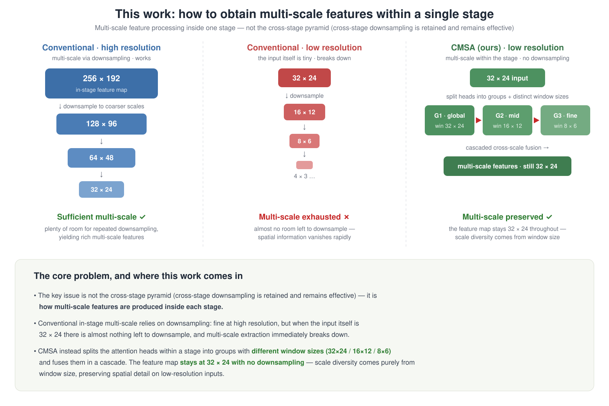
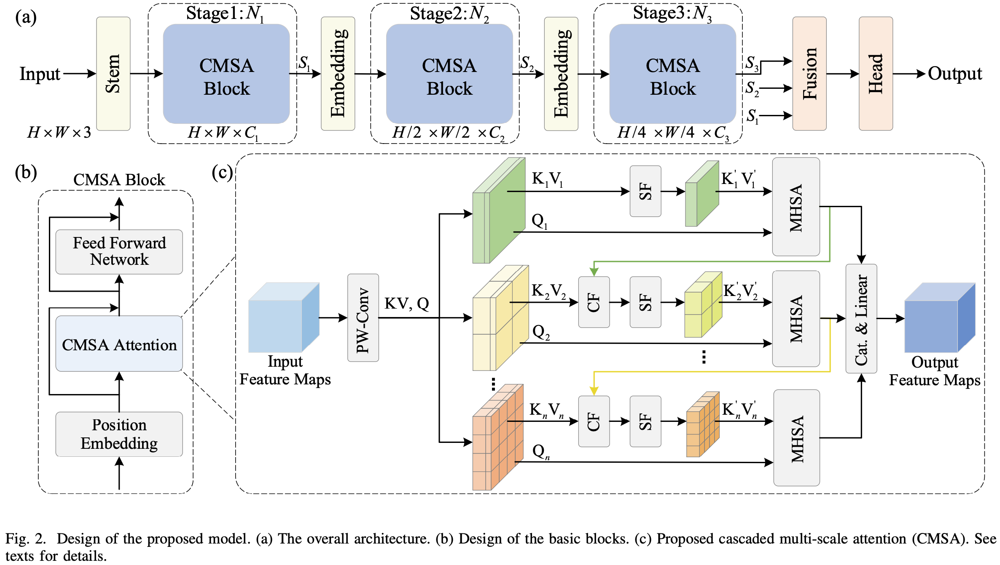
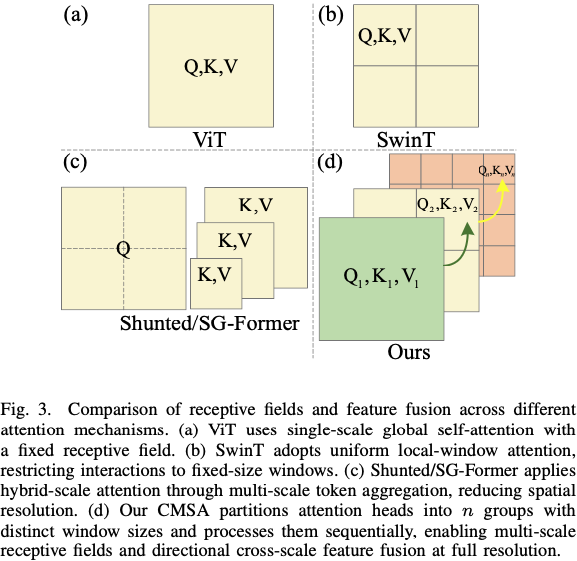
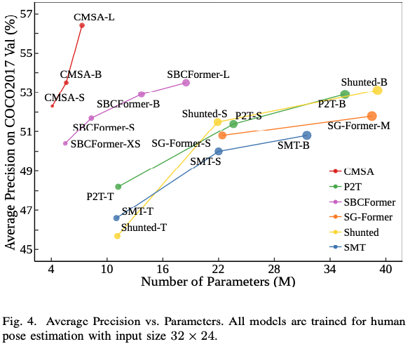

# CMSA: Cascaded Multi-Scale Attention

**[Cascaded Multi-Scale Attention for Enhanced Multi-Scale Feature Extraction and Interaction with Low-Resolution Images](https://arxiv.org/abs/2412.02197)**

> Accepted by **IEEE Transactions on Multimedia (IEEE TMM), 2026**.
> This repository contains the official PyTorch implementation for **human pose estimation on COCO 2017**. Code for the other tasks in the paper (head pose estimation, small-image classification, semantic segmentation) is being prepared for release.

---

## Introduction

Most computer-vision benchmarks quietly assume the input is a sharp, well-resolved image. The real world is rarely so cooperative: a distant pedestrian in a surveillance feed, the limited compute of an edge device, a video stream compressed for transmission—in many settings the target reaching the model is only a few dozen pixels tall. When a person occupies just `32×24` pixels, virtually every pose-estimation network designed for high resolution loses accuracy sharply.

This work targets exactly that **low-resolution** regime and introduces a new attention mechanism—**Cascaded Multi-Scale Attention (CMSA)**. Its core claim fits in one sentence: **extract and interact multi-scale features entirely *within a single processing stage*, without any downsampling.**

### The overlooked problem: multi-scale *inside* a stage

Multi-scale features are almost mandatory for tasks like pose estimation—the torso needs a large receptive field for global context, while keypoints such as wrists and ankles depend on fine local detail. Mainstream approaches (HRNet, HRFormer, and various CNN–ViT hybrids) obtain multi-scale features in a strikingly uniform way: **repeatedly downsample the feature map to build a pyramid of decreasing resolutions.**

That recipe works well for high-resolution inputs—a `256×192` map can descend through `128×96 → 64×48 → 32×24` and still keep enough spatial resolution at every level. But when the **input itself is only `32×24`**, the problem surfaces immediately: further downsampling gives `16×12`, then `8×6`, and spatial information runs dry—each additional step means a catastrophic loss of detail.

<p align="center">
   <br>
  <em>The motivation at a glance. The conventional downsampling pyramid works at high resolution (left) but exhausts spatial information when the input itself is tiny (middle). CMSA builds multi-scale features within the stage—via grouped heads with different window sizes and cascaded fusion—while keeping the feature map at full resolution (right).</em>
</p>

Here lies a point that is easy to misread, which the paper is careful to clarify: **CMSA does not remove the cross-stage downsampling pyramid.** Cross-stage spatial integration is fundamental to CNN–ViT hybrids and remains effective at any resolution. CMSA addresses a *different* level of the problem—**how to produce multi-scale features within each stage.** Conventionally, even the within-stage multi-scale relies on downsampling (or the equivalent token merging), which is precisely the most fragile link under low resolution. CMSA's insight is to decouple "within-stage multi-scale" from downsampling altogether.


### How CMSA works

CMSA is an attention mechanism for CNN–ViT hybrids that extracts and integrates features across scales **without downsampling the input or feature maps**. It combines:

- **Grouped multi-head self-attention** — attention heads are split into groups, each processing a different scale.
- **Window-based local attention** (Swin) — each group uses a different window size `sₖ × tₖ` to form a distinct receptive field, from global (window = full map) to local.
- **Cascaded multi-scale fusion** — features flow from lower to higher scales; each group's output updates the key/value of the next group via **channel fusion (CF)** and **spatial fusion (SF)**.

The result is effective multi-scale feature extraction and cross-scale interaction at **full spatial resolution**, which is especially valuable for low-resolution inputs.

## Architecture

<p align="center">
   <br>
  <em>(a) Overall hierarchical architecture. (b) CMSA block. (c) Cascaded Multi-Scale Attention.</em>
</p>

<p align="center">
   <br>
  <em>Receptive fields and fusion across attention mechanisms. Unlike ViT (single-scale global),
  SwinT (uniform local windows), and Shunted/SG-Former (token-merging that reduces resolution),
  CMSA partitions heads into groups with distinct window sizes and fuses them cascade-style at full resolution.</em>
</p>

### Model Variants

Three variants trade off accuracy against size (see paper, Table I). They are implemented in [models/cmasformer.py](models/cmasformer.py):

| Variant | Model name (`--model`) | Params | Notes |
|---------|------------------------|:------:|-------|
| CMSA-S  | `CMSAFormer_S_32` | ~4.0–4.2 M | Smallest, fastest |
| CMSA-B  | `CMSAFormer_B_32` | ~5.4–5.7 M | Balanced |
| CMSA-L  | `CMSAFormer_L_32` | ~7.1–7.4 M | Best accuracy, still lightweight |

All variants use a 3-stage pyramid; stage 1 uses up to `n = 3` head groups with window sizes `{32×24, 16×12, 8×6}`, and later stages use `n = 2` groups with progressively smaller windows. Structural re-parameterization (3×3 depth-wise conv + point-wise conv + BN branches, merged at inference) is used to balance accuracy and efficiency.

---

## Getting Started

### Installation

Tested with Python 3.8, PyTorch ≥ 1.10, and CUDA 11.x.

```bash
# 1. Clone
git clone git@github.com:xyongLu/CMSA.git
cd CMSA

# 2. Create environment
conda create -n cmsa python=3.8 -y
conda activate cmsa

# 3. Install PyTorch (match your CUDA version)
pip install torch torchvision --index-url https://download.pytorch.org/whl/cu118

# 4. Install the remaining dependencies
pip install timm yacs json-tricks munkres opencv-python pycocotools scipy ptflops Cython
```

### Repository structure

```
CMSA/
├── config/                   # default configuration (yacs) — config/default.py
├── experiments/coco/vits/    # experiment configs: cmsa_s_32.yaml / cmsa_b_32.yaml / cmsa_l_32.yaml
├── lib/                      # datasets, heatmap heads, NMS, evaluation utilities
├── models/                   # CMSAFormer (cmasformer.py)
├── files/                    # figures used in this README
├── dist_train.py             # training entry point
├── dist_eval.py              # evaluation entry point
├── engine.py                 # train / eval loops
└── losses.py, mixup.py, samplers.py, transforms.py, utils.py
```

### Data Preparation

Download [COCO 2017](https://cocodataset.org/#download) (train/val images and person keypoint annotations). By default the configs expect the dataset at `../../Data/coco2017` relative to the repository (see `DATASET.ROOT` in the yaml files—edit it to point at your own location):

```
Data/coco2017/
├── annotations/          # person_keypoints_train2017.json, person_keypoints_val2017.json
├── train2017/
└── val2017/
```

### Training

Train from scratch. Pick the model/config pair for the variant you want (the released configs target `32×24` inputs):

```bash
# Single GPU — CMSA-L, 32 × 24 inputs
python dist_train.py \
  --model CMSAFormer_L_32 \
  --cfg experiments/coco/vits/cmsa_l_32.yaml \
  --batch-size 48

# Multi-GPU (e.g. 2 GPUs)
torchrun --nproc_per_node=2 dist_train.py \
  --model CMSAFormer_L_32 \
  --cfg experiments/coco/vits/cmsa_l_32.yaml
```

Checkpoints and logs are written to `outputs/` and `logs/` (see `OUTPUT_DIR` / `LOG_DIR` in the config).

### Evaluation

```bash
python dist_eval.py \
  --model CMSAFormer_L_32 \
  --cfg experiments/coco/vits/cmsa_l_32.yaml \
  --resume path/to/checkpoint.pth
```

---

## Results

### Human Pose Estimation (COCO 2017)

Bottom-up human pose estimation on **COCO 2017**, predicting 17 keypoints from cropped, resized person images; the resize target controls input resolution. Accuracy is measured by Average Precision (AP) based on object keypoint similarity (OKS).

CMSA outperforms state-of-the-art methods **across all resolutions with far fewer parameters**, and the margin widens as resolution drops.

**Results on COCO 2017 val** (selected; FLOPs at single scale):

| Input     | Model      | Params (M) | FLOPs (G) | AP↑     |
|-----------|------------|:----------:|:---------:|:-------:|
| 128 × 96  | HRNet-W32  | 28.5       | 1.9       | 66.9    |
| 128 × 96  | ViTPose-B  | 86.0       | 17.0      | 67.8    |
| 128 × 96  | **CMSA-B** | **5.6**    | 4.1       | 70.3    |
| 128 × 96  | **CMSA-L** | **7.3**    | 5.1       | **71.8** |
| 64 × 48   | UDP (HRNet-W32) | 28.6  | 1.9       | 62.8    |
| 64 × 48   | ViTPose-B  | 86.0       | 16.9      | 63.8    |
| 64 × 48   | **CMSA-B** | **5.6**    | 3.7       | 65.2    |
| 64 × 48   | **CMSA-L** | **7.3**    | 4.6       | **66.0** |
| 32 × 24   | UDP (HRNet-W32) | 28.6  | 1.9       | 51.9    |
| 32 × 24   | ViTPose-B  | 86.0       | 16.9      | 51.2    |
| 32 × 24   | **CMSA-S** | **4.1**    | 0.7       | 52.3    |
| 32 × 24   | **CMSA-B** | **5.6**    | 0.9       | 53.5    |
| 32 × 24   | **CMSA-L** | **7.3**    | 1.1       | **56.4** |

CMSA is fast as well as accurate: on a single RTX 3090, CMSA-L runs at ~987 FPS with `32×24` inputs (vs. ~194 FPS for ViTPose-B).

<p align="center">
   <br>
  <em>AP vs. parameters on COCO 2017 (32 × 24 input). CMSA dominates the accuracy–parameter trade-off.</em>
</p>

### Head Pose Estimation

> Code for this task will be released later; the results below are from the paper (Table III).

Landmark-free head pose estimation: predict **yaw, pitch, roll** directly from a cropped face image. Models are trained on **300W-LP** and evaluated on **BIWI** and **AFLW2000**, using binned classification with soft stage-wise regression. Accuracy is reported as **Mean Absolute Error (MAE, lower is better)**.

At low resolutions (64 × 64 and 32 × 32), CMSA reaches **state-of-the-art MAE on AFLW2000 and BIWI**—CMSA-L even beats many models that operate on much higher-resolution inputs.

**Results — MAE↓** (selected):

| Input   | Model        | Params (M) | BIWI MAE↓ | AFLW2000 MAE↓ |
|---------|--------------|:----------:|:---------:|:-------------:|
| 64 × 64 | TokenHPE-v2  | 85.9       | 4.83      | 5.17          |
| 64 × 64 | 6DRepNet     | 43.8       | 4.02      | 5.04          |
| 64 × 64 | **CMSA-B**   | **5.4**    | 4.30      | 4.48          |
| 64 × 64 | **CMSA-L**   | **7.1**    | **3.99**  | **4.38**      |
| 32 × 32 | TokenHPE-v2  | 85.7       | 5.66      | 6.05          |
| 32 × 32 | 6DRepNet     | 43.8       | 5.51      | 6.07          |
| 32 × 32 | **CMSA-S**   | **4.0**    | 4.33      | 4.59          |
| 32 × 32 | **CMSA-B**   | **5.4**    | 4.55      | 4.51          |
| 32 × 32 | **CMSA-L**   | **7.1**    | 4.48      | **4.46**      |

---

## Datasets

| Task                  | Train      | Evaluation            |
|-----------------------|------------|-----------------------|
| Human pose estimation | COCO 2017  | COCO 2017 val         |
| Head pose estimation  | 300W-LP    | BIWI, AFLW2000        |

Low-resolution inputs are produced by resizing crops to the target size (e.g. 32 × 24 for pose, 32 × 32 for head pose)—**no super-resolution preprocessing is used**. In the paper, applying SR (SwinIR) before pose estimation actually *hurts* accuracy, since it improves visual reconstruction but not the spatial cues needed for keypoint localization.

## Citation

```bibtex
@article{lu2024cascaded,
  title={Cascaded Multi-Scale Attention for Enhanced Multi-Scale Feature Extraction and Interaction with Low-Resolution Images},
  author={Lu, Xiangyong and Suganuma, Masanori and Okatani, Takayuki},
  journal={arXiv preprint arXiv:2412.02197},
  year={2024}
}
```

## License

See [LICENSE](LICENSE).
